<!-- ==============================================
   BILLMATE — Invoice Management System
   Freelance Project (Private Client)
   Public Showcase Version
============================================== -->

  

<h1 align="center">💼 BillMate — Invoice Management System</h1>

  <b>Freelance Project (Private Client)</b> 
  Desktop Invoice Management Application

---

# 📌 About The Project

**BillMate** is a modern desktop invoice management system developed for a private client to help organizations efficiently manage, track, and organize invoices.

The application streamlines invoice workflows through:

- Automated invoice number generation
- Advanced search & filtering
- Excel export functionality
- Clean and modern dark-themed interface
- Fast and lightweight local database system

> ⚠️ This repository is a public showcase version.  
> The full source code is private and not publicly available.

---

# 🚀 Features

✅ Add, edit, and delete invoices  
✅ Automatic invoice number generation (Year + Sequence)  
✅ Advanced multi-criteria search  
✅ Dynamic filtering and sorting  
✅ Export invoices and reports to Excel  
✅ Status tracking (Paid / Pending / Cancelled, etc.)  
✅ Structured regional organization  
✅ Modern Dark Blue UI  
✅ Lightweight local database

---

# 🖥️ Application Preview

## 🔹 Main Dashboard

  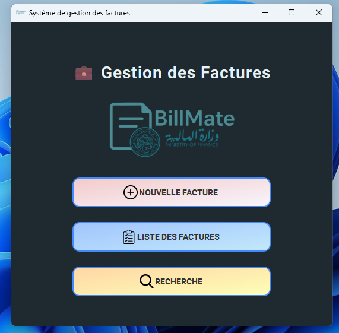

## 🔹 Invoice List

  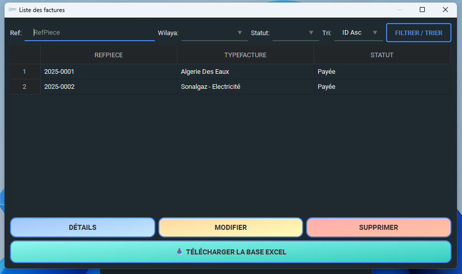

## 🔹 Add New Invoice

  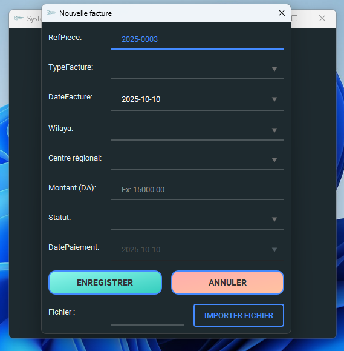

## 🔹 Invoice Details

  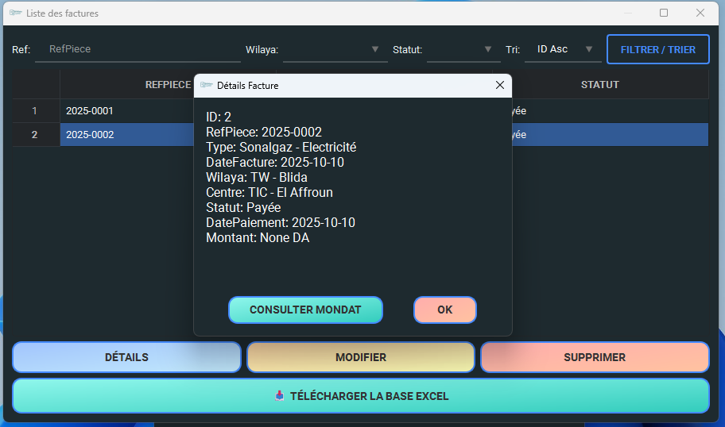

## 🔹 Advanced Search

  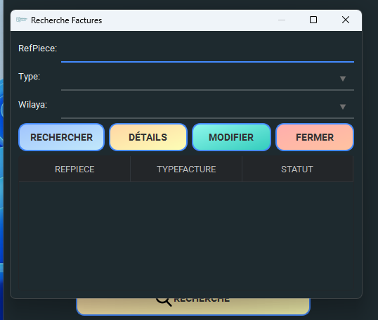

## 🔹 Edit Invoice

  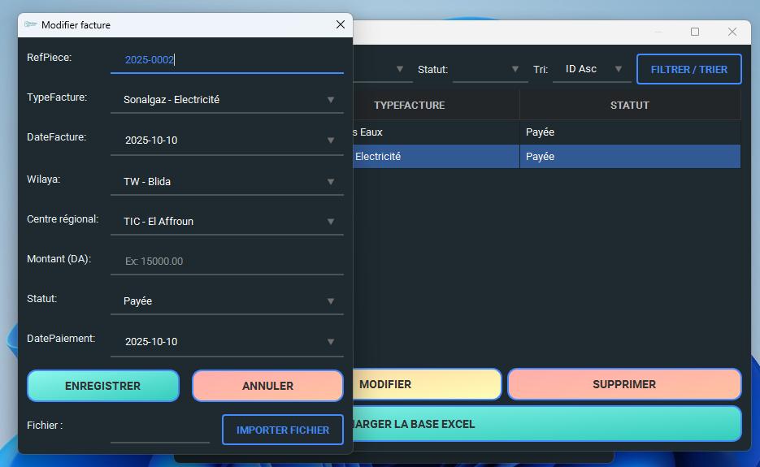

## 🔹 Invoice Status Management

  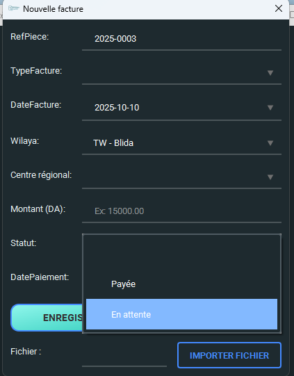

## 🔹 Regional Centers Management

  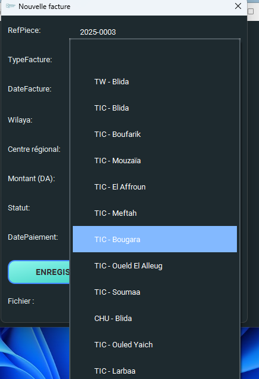

## 🔹 Wilaya Selection

  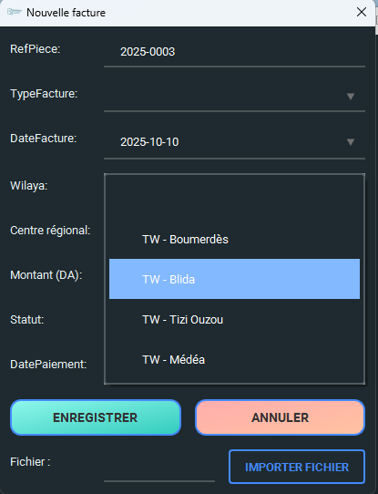

## 🔹 Invoice Type Management

  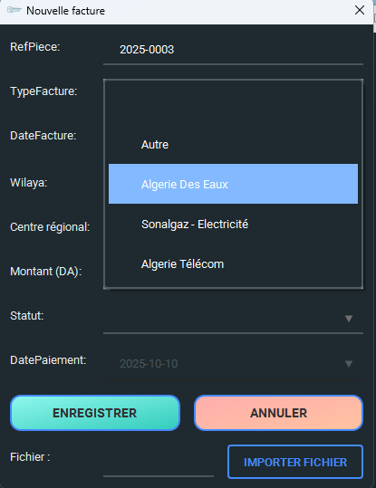

## 🔹 Invoice Deletion Confirmation

  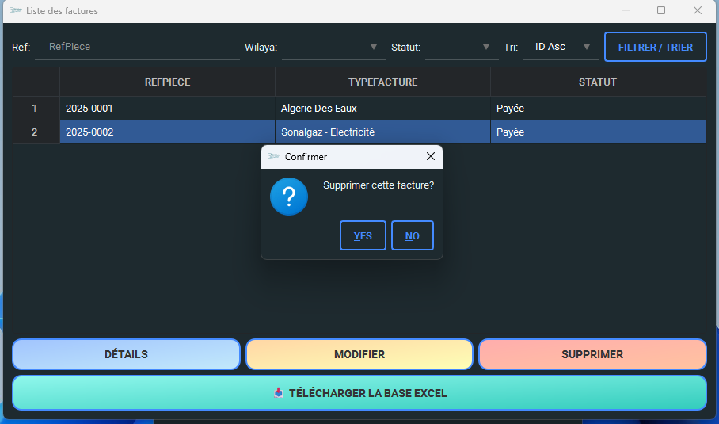

---

# 🎬 Demo

You can watch the application demo here:

📽️ **Demo Video:**  
[Download / View Demo](demo.mp4)

---

# 🛠 Tech Stack

- **Python**
- **SQLite / SQL**
- **Tkinter**
- **Pandas**
- **OpenPyXL**

---

# 🏗 Architecture Overview

- Desktop-based system
- Local database storage
- Excel export engine
- Modular UI structure
- Clean separation between UI and data layer

---

# 🔐 Project Status

This project was developed as a **private freelance/client solution**.

✅ Completed and delivered  
✅ Actively used by the client  
❌ Source code not publicly available

This repository is intended for **portfolio and demonstration purposes only**.

---

# 👨‍💻 Developer

Freelance Desktop Application Developer  
Specialized in Python-based business solutions

For professional inquiries:
📧 saharaoui.info@gmail.com

---

# 📄 License

© 2026 — All rights reserved.  
This repository does not grant rights to use, copy, or redistribute the software.
